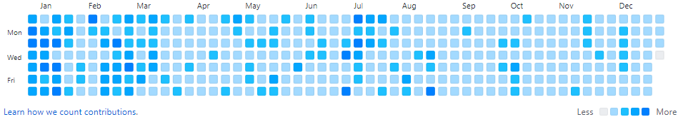
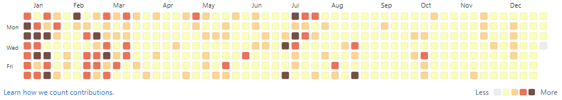

<p align=center>
    
</p>

<h2 align=center>
    Colorful Contributions
</h2>

<p align=center>
    Make your contribution graph colorful !
</p>

<p align=center>
    
    
</p>

<p>🎨 <strong>Colorful Contributions</strong> is an chrome extension app that makes graphs colorful</p>
<p>📌 Pull requests and <a href="https://github.com/Xenia101/Colorful-Contributions/issues">issue</a> are welcome :)</p>
 
---

## Installation

1. Clone or Download this repository
2. Enter `chrome://extensions/` in chrome
3. Click on `LOAD UNPACKED` button
4. Upload local repository directory

- Enable Developer Mode by clicking the toggle switch next to Developer mode
- https://developer.chrome.com/docs/extensions/mv2/getstarted/

## Customizing

- ### Using UI on tab
    - [ ] User customizing UI
    - [ ] Refectoring 

- ### Direct access to code

    - Add the code you want in `/css/colorful.css`
    ```css
    /*
        ./css/colorful.css
    */

    #custom-style>li:nth-child(1)
    background-color: #EBEDF0;
    ...
    #custom-style>li:nth-child(5)
    background-color: #0080FF;
    ```

    - Add the code in `./popup.html`
    ```html
    <!--
        ./popup.html
    -->

    <tr>
        <td>
            <div class="contrib-legend">
                <ul class="legend" id="custom-style"> <!--custom-style id-->
                    <li></li>
                    <li></li>
                    <li></li>
                    <li></li>
                    <li></li>
                </ul>
            </div>
        </td>
        <td>
            <input type="radio" name="customRadio" value="custom-style"> <!--custom-style value-->
        </td>
    </tr>
    ```

## Browser Support

|  	|  	|  	|  	|  	|
|:------:	|:------------:	|:--:	|:------:	|:-----:	|
|    ✔   	|       -      	|  - 	|    -   	|   -  	|
> Chrome-only (chrome extension app)

---

<p align=center>© 2021 XENIA101 - Released under GPL License 2.0</p>
